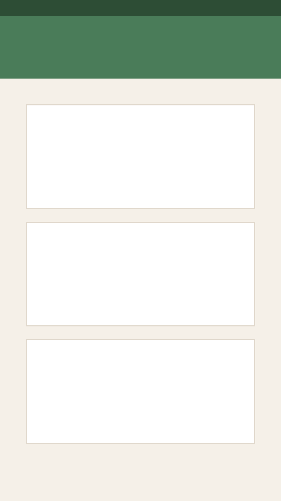

# 🌿 Jaliz (جالیز) - Your Cozy Plant Companion

Jaliz is a beautiful, bilingual (English/Farsi) web application designed for plant lovers. It serves as your personal gardening dashboard, helping you keep track of your plant collection, watering schedules, and plant health, while also providing a marketplace to trade plants with the community.

## ✨ Features

- **🪴 Comprehensive Plant Management**: Add plants to your collection with detailed properties (indoor/outdoor, light exposure, pot type, drainage).
- **💧 Smart Watering Schedules**: Automatically calculates your next watering date and alerts you.
- **🤖 AI Plant Analysis**: Don't know what plant you have? Upload a photo or type its name, and our AI (powered by FastAPI & Python) will automatically identify it and fill in care tips!
- **🌍 Bilingual & RTL Support**: Full support for both English and Farsi, including localized Shamsi (Jalali) dates for Persian users.
- **🎨 Warm & Cozy Design**: A highly aesthetic, friendly UI with pastel greens, rounded corners, and a welcoming "plant parent" tone.
- **🛒 Plant Marketplace**: Discover, swap, and purchase plants from other users in the Jaliz community.
- **📱 Responsive Layout**: Works perfectly on desktop and mobile.
- **⚡ Local-First Database**: Uses SQLite via Prisma 6 for a fully self-contained, easy-to-deploy architecture.

## 📸 Screenshots

*(Note: Replace these placeholder images with actual screenshots in the `public/screenshots/` directory)*

### Dashboard

*A cozy overview of your plants' happiness and upcoming watering tasks.*

### My Plants Collection

*A beautiful grid view of your plant collection with quick-glance status indicators.*

### Community Marketplace

*Discover and exchange plants with fellow plant enthusiasts.*

## 🚀 Getting Started

Jaliz uses a dual-stack architecture with Next.js for the frontend/API and a Python backend for AI features.

### Prerequisites
- Node.js 20+
- Python 3.10+
- `uv` or `pip` for Python dependency management

### Installation

1. **Install Node dependencies:**
   ```bash
   npm install
   ```

2. **Setup the Python environment:**
   ```bash
   cd api
   python -m venv .venv
   source .venv/bin/activate
   pip install -r requirements.txt
   ```

3. **Initialize the Database:**
   ```bash
   npm run postinstall
   ```

4. **Run the Development Servers:**
   This command starts both the Next.js app and the Python FastAPI server concurrently.
   ```bash
   npm run dev
   ```

5. Open [http://localhost:3000](http://localhost:3000) with your browser to see the app!

## 🛠 Tech Stack

- **Frontend**: Next.js 16 (App Router), React 19, Tailwind CSS v4, Lucide Icons, Radix UI
- **Backend (Main)**: Next.js Server Actions, Prisma 6 ORM, SQLite
- **Backend (AI)**: Python, FastAPI, Uvicorn
- **Testing**: Vitest
